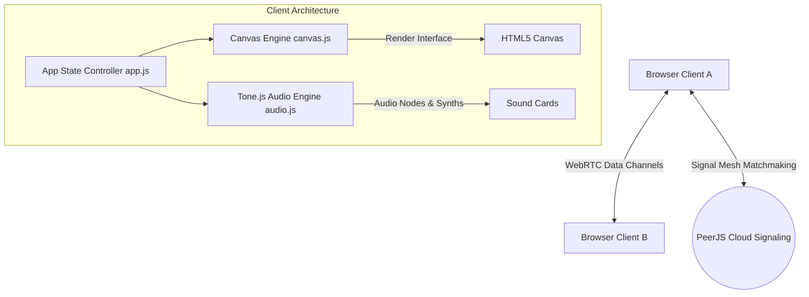

# 🧘 The Digital Sanctuary — Ambient Virtual Co-working Space

[](https://opensource.org/licenses/MIT)

**The Digital Sanctuary** is a serverless, client-side, peer-to-peer (P2P) virtual co-working space designed for colleagues and friends to focus together in customizable ambient rooms. 

Built with 100% client-side technologies—**Vanilla JS, Tone.js, and HTML5 Canvas**—it coordinates user rooms, ambient mixers, animated plants, keystroke counters, and synchronized canvas-drawn Post-it notes over encrypted WebRTC data channels.

---

## ✨ Features

- **P2P Virtual Space:** Connect instantly with colleagues using a unique, shareable link. No central servers, no database, no signups.
- **Dynamic Cabin Time of Day:** Syncs with system time or allows manual overrides (Sunrise, Day, Sunset, Night) with custom atmospheric sky gradients and blinking stars.
- **Ambient Sound Mixer:** Mix custom levels of rain, thunder, ocean waves, fireplace crackle, and lofi radio streaming.
- **Collaborative Sticky Notes:** Create, color-code, and category-tag notes (Work, Study, Personal, Ideas). Drag-and-drop notes across colleagues' window quadrants, or click cards to view them in a zoomed-in glassmorphic reading overlay.
- **Haptic Keyclick Synths:** Synthesize tactile keyboard sound profiles (Thock, Blue, Typewriter, Bubble) in real-time. Keystrokes are synchronized across peers to generate quiet typing feedback.
- **Interactive Visual Elements:** A cozy cat that wakes up when you type, and a potted plant that grows dynamically based on your keystroke focus sessions.
- **Adjustable Pomodoro Timer:** Keep your team focused with a visually ticking glassmorphic Pomodoro clock featuring adjustable sessions and custom chime notifications.

---

## 🛠️ Architecture & Tech Stack



- **Frontend Core:** Pure Semantic HTML5, CSS3 Custom Properties (Glassmorphism design language), and ES6 JavaScript modules.
- **Audio Synthesis:** [Tone.js (v14)](https://tonejs.github.io/) orchestrates dynamic audio routing, custom synthesis envelope click profiles, crackle triggers, and proximity panning filters.
- **P2P Coordination:** [PeerJS](https://peerjs.com/) handles WebRTC signaling over free-tier public matchmaking channels to establish peer connections.
- **Canvas Rendering:** A high-performance canvas loop paints background sky grids, animated weather particles, custom vector room outlines, name tags, and user notes.

---

## 🔒 Security & Privacy (Open Source Sweep)

The Digital Sanctuary is hardened to be safe for public open-source distribution:
- **No Remote XSS Scripting:** User text entries (notes, names, custom tags) are never evaluated via `innerHTML` or `insertAdjacentHTML`. Inputs are dynamically parsed into safe DOM `textContent` nodes or drawn directly onto the Canvas context using `fillText`.
- **Content Security Policy (CSP):** The application contains a strict CSP `<meta>` header. It blocks inline script executions, constraints network connections specifically to PeerJS coordination servers and Google Fonts, and keeps resources strictly sandboxed.
- **P2P Rate & Loop Guarding:**
  - Standard connections are restricted to a maximum of 10 concurrent peers.
  - The incoming `PEER_LIST` arrays are sliced to a safe threshold to prevent connection loops or recursion DoS attacks.
  - Sticky notes are capped at `25` per workspace quadrant, with strict range clamping on coordinate percentages (`0.05` to `0.95`) and string lengths.
  - Remote click synth triggers are checked against a strict whitelist of known sound profiles to prevent invalid parameters or audio node exploitation.

---

## 🚀 Getting Started

### Prerequisites

You only need a modern web browser (Chrome, Firefox, Safari, Edge).

### Running Locally

Since the application is serverless, you can host it with any simple static web server.

1. Clone or download the files.
2. In your terminal, navigate to the folder and run:
   ```bash
   npx -y http-server -p 8080
   ```
3. Open `http://localhost:8080` in your web browser.
4. Click **ENTER SANCTUARY** (this acts as the browser permission gate to enable the Web Audio API context).

---

## 📝 License

Distributed under the MIT License. See [LICENSE](LICENSE) for details.
